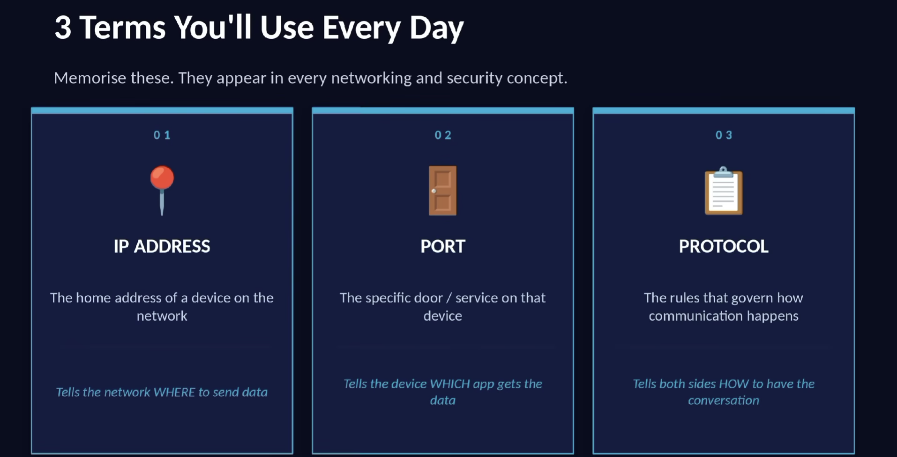

# Chapter 1: What is Network?

**Network:**  is Simply a collection of Devices that are connected together so they can share information .

## IP Address
* Its Like a Location for every device on the network 
* Every Device on a network has a UNIQUE IP address
* it tells the network: WHERE to deliver this data
* Format: four numbers (0-255) seperated by dots (IPv4) 
* Example: 192.168.1.100

## PROTOCOL
* its a formal set of rules for communication
* both devices MUST follow the same protocol to understand each other
* Like social rules: knock -> "Who's there ?" -> Omar -> "Come in"

### Important Cybersecurity Protocols

| Protocol | Full Name | What it does |
|----------|----------|--------------|
| TCP | Transmission Control Protocol | Reliable data transfer between devices |
| UDP | User Datagram Protocol | Fast, connectionless data transfer |
| IP | Internet Protocol | Routes packets across networks |
| HTTP | HyperText Transfer Protocol | Web traffic (not secure) |
| HTTPS | HTTP Secure | Encrypted web traffic (TLS) |
| DNS | Domain Name System | Translates domain names to IPs |
| DHCP | Dynamic Host Configuration Protocol | Automatically assigns IP addresses |
| FTP | File Transfer Protocol | Transfers files (insecure) |
| SFTP | SSH File Transfer Protocol | Secure file transfer over SSH |
| SSH | Secure Shell | Secure remote login & command execution |
| TLS | Transport Layer Security | Encrypts data in transit (used in HTTPS, email, etc.) |
| SSL | Secure Sockets Layer | Older encryption protocol (replaced by TLS) |
| SMTP | Simple Mail Transfer Protocol | Sends emails |
| IMAP | Internet Message Access Protocol | Access & sync emails |
| POP3 | Post Office Protocol v3 | Downloads emails |
| SMB | Server Message Block | File sharing in Windows networks |
| NTP | Network Time Protocol | Syncs system time |
| ICMP | Internet Control Message Protocol | Network diagnostics (ping, traceroute) |
| ARP | Address Resolution Protocol | Maps IP addresses to MAC addresses |

## PORT
* is a logical endpoint (numbered 0-65535)
* Same device, different services - each has its own port
* think of it like doors on the same building - each leads somewhere different 
* Open ports = open ports = attack surface

### Important Cybersecurity Ports

| Port | Protocol | Service |
|------|----------|---------|
| 20 / 21 | FTP | File Transfer |
| 22 | SSH | Secure Remote Access |
| 23 | Telnet | Remote Access (Insecure) |
| 25 | SMTP | Email Sending |
| 53 | DNS | Domain Name System |
| 80 | HTTP | Web Traffic |
| 443 | HTTPS | Secure Web Traffic |
| 110 | POP3 | Email Retrieval |
| 143 | IMAP | Email Sync |
| 3389 | RDP | Remote Desktop |
| 445 | SMB | File Sharing (Windows) |
| 3306 | MySQL | Database |
| 5432 | PostgreSQL | Database |
| 5900 | VNC | Remote Desktop |
| 8080 | HTTP Proxy | Web Applications |

