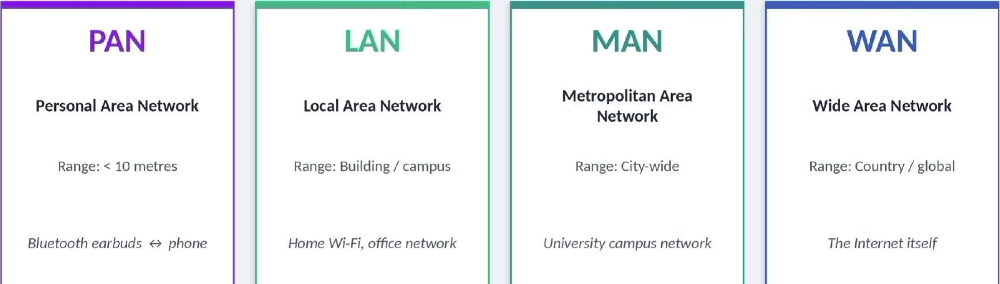
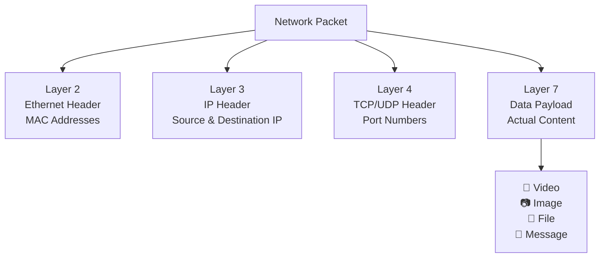
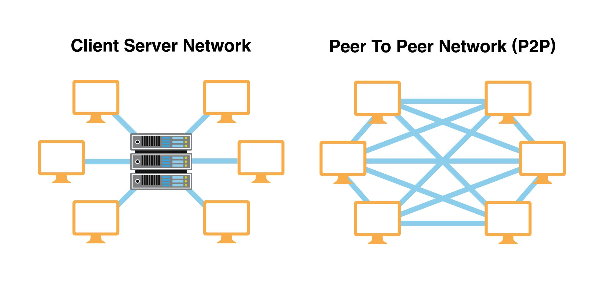

# Chapter 2: Network Fundamentals

## Types of netwoks



**1. LAN - Local Area Network**
- small, local network in a building or limited area
- Examples : home Wi-Fi, Scholl computer lab
- Devices are close - data travels fast with low latency
- Privately controlled - you decide who connects
- A WLAN is simply a LAN that uses Wi-Fi instead of cables
- Once inside a LAN, attacker can see ALL other dedvices
- IMPORTANT SECURITY CONCEPT : Network SEGMENTATION - dividing LAN into isolated zones.
 
**2. WAN - Wide Area Network**
- Large geographic areas - cities, countries 
- The INTERNET is the largest WAN
- Companies use private WANs to connect offices across cities
- Data passes through ISPs, routers, undersea cables
- Much slower and less private than LAN
- ENCRYPTION is essential for data travelling over a WAN

**3. WAN - Other Important Network Types
* PAN: Personal Area Network - Bluetooth phone to earbuds, < 10m range
* MAN: Metropolitan Area Network - University across city buildings
* WLAN: Wireless LAN - Your home Wi-Fi network, uses 802.11 standards
* VPN: Virtual Private Network - Encrypted tunnel through a public network

## Network Components (Hardware)

| Device            | OSI Layer  | Purpose                                                      |
| ----------------- | ---------- | ------------------------------------------------------------ |
| Router            | Layer 3    | Connects different networks and routes traffic between them  |
| Switch            | Layer 2    | Connects devices within the same LAN                         |
| Firewall          | Layers 3-7 | Filters and controls network traffic based on security rules |
| Access Point (AP) | Layers 1-2 | Provides wireless network connectivity                       |
| NIC               | Layers 1-2 | Hardware that enables a device to communicate on a network   |

**Router - The Network Gateway**
What It Does:
- Like a traffic cop at an intersection - directs cars (data) on their way
- Connects different networks (e.g., your LAN to the Internet)
- Routes packets based on destination IP addresses
- Acts as the default gateway for devices on a network
- Operates at **OSI Layer 3 (Network Layer)**

Security Perspective:
- A compromised router = expose all network traffic
- Weak router passwords and outdated firmware are common attack vectors
- Misconfigured routers may allow unauthorized access

---

**Switch - The LAN Connector**
What It Does:
- Smarter than a hub - sends each message only to its target device
- Connects devices within the same local network
- Uses MAC addresses to forward frames efficiently
- Reduces unnecessary network traffic
- Operates at **OSI Layer 2 (Data Link Layer)**

Security Perspective:
- Vulnerable to MAC flooding attacks
- Can be targeted for ARP spoofing and network sniffing
- Managed switches provide security features such as VLANs and port security

>A **MAC Address (Media Access Control Address)** is a unique identifier assigned to a network interface (NIC).

Think of it like:

| Type        | Description                               |
| ----------- | ----------------------------------------- |
| IP Address  | Like a home address - can change          |
| MAC Address | Like a national ID number - usually fixed |

Example:

```text
IP Address: 192.168.1.10
MAC Address: 00:1A:2B:3C:4D:5E
```

---

**Firewall - The First Line of Defense**

What It Does:
- Monitors incoming and outgoing traffic
- Like a nightclub bouncer - you're on the list, you get in. You're not? Turned away.
- Allows or blocks traffic according to defined rules
- Filters traffic by IP address, port, protocol, and application
- Operates across **OSI Layers 3-7**

Common Firewall Types:
- Packet Filtering Firewall
- Stateful Firewall
- Next-Generation Firewall (NGFW)
- Web Application Firewall (WAF)

Security Perspective:
- Essential for protecting networks from unauthorized access
- Helps detect and block malicious traffic
- Should be combined with other security controls for defense in depth

---

**Access Point (AP) - Wireless Connectivity**

What It Does:
- Provides Wi-Fi access to wireless devices
- Connects wireless clients to the wired network
- Operates at **OSI Layers 1-2**

Security Perspective:
- Weak Wi-Fi passwords can expose the network
- Use WPA2 or WPA3 encryption

---

**NIC (Network Interface Card)**

What It Does:
- Network Interface Card Hardware inside every device
- Allows a device to communicate on a network
- Provides a unique MAC address
- Available in both wired and wireless forms
- Operates at **OSI Layers 1-2**

Security Perspective:
- MAC addresses can be spoofed
- Network monitoring tools often analyze NIC traffic
- Essential component for packet capture and network analysis

## How Packets Travel (Packet Switching)
**Did you know?**  
When you upload or send a video over the internet, it is not transmitted as a single file.  
Instead, the video is broken into **thousands of small packets**.  
  
These packets:  
- Travel independently across the network  
- May take different routes to reach the destination  
- Contain source and destination information  
- Are reassembled in the correct order when they arrive   
This process makes data transmission faster, more reliable, and more efficient.




**Inside a Network Packet**
Every packet contains multiple layers of information that help it travel across the network and reach the correct destination.

| Layer   | Contains                            | Purpose                                           |
| ------- | ----------------------------------- | ------------------------------------------------- |
| Layer 2 | Ethernet Header (MAC Addresses)     | Delivers data within the local network            |
| Layer 3 | IP Header (Source & Destination IP) | Routes packets between networks from who to where |
| Layer 4 | TCP/UDP Header (Port Numbers)       | Identifies the application or service             |
| Layer 7 | Data Payload                        | The actual content being transmitted              |

Key Facts:
- Typical packet size is between **500-1500 bytes**
- Large files are divided into **thousands of packets**
- Each packet carries its own addressing and routing information
- Packets may travel through **different paths** across the internet
- The destination device reassembles all packets into the original data

Security Perspective:
- Network analyzers such as **Wireshark** can capture packets in transit
- If traffic is **unencrypted**, attackers may read sensitive information (Packet Capture Attack or Sniffing Attacks)
- Encryption protocols such as **HTTPS, SSH, and TLS** help protect packet contents from interception
## How devices interact on a network
 there is tow main models for how device interact on a network, they are **client-server mdoel** and **peer to peer (P2P) model** 
 


---

**Client-Server Model (The "Traditional" Way)**
This is how most of your daily internet use Google, Netflix, Instagram actually works.
- **Logic:** A powerful central machine (the **Server**) waits for requests. Your device (the **Client**) asks for data, and the server serves it.
- **Centralization:** All the "gold" (user data, passwords, files) is stored in one place.
- **Security Risk:** The server is a **High-Value Target**. If a hacker breaches Netflix's servers, they get access to millions of accounts at once. This is known as a **Single Point of Failure**.

---

**Peer-to-Peer (P2P) Model (The "Community" Way)**
Commonly used for file sharing (BitTorrent) or decentralized technologies like Blockchain.
- **Logic:** There is no "boss" computer. Every device on the network acts as both a client and a server at the same time.
- **Decentralization:** Files are broken into tiny pieces and spread across thousands of user devices.
- **Security Risk:** Because there's no central "C2" (Command and Control) server, it's nearly impossible for authorities to "shut down" a P2P network. Malware uses this to spread stealthily, as killing one infected computer doesn't stop the rest of the network from communicating.

---

**Side-by-Side Breakdown**

|**Feature**|**Client-Server**|**Peer-to-Peer (P2P)**|
|---|---|---|
|**Control**|Centralized|Decentralized|
|**Maintenance**|Easier (fix one server)|Difficult (no single admin)|
|**Scalability**|Server can get overloaded|Network gets stronger with more peers|
|**Attack Surface**|Single high-value target|Thousands of low-value targets|
|**Stability**|If server goes down, everyone is out|Extremely resilient to shutdowns|

> **Analogy:** Client-Server is like a library (one building has all the books). P2P is like a neighborhood book club (everyone has one book and swaps with each other).

## Bandwidth vs Latency

| Feature                     | Bandwidth                                                    | Latency                                                             |
| :-------------------------- | :----------------------------------------------------------- | :------------------------------------------------------------------ |
| **Definition**              | Maximum data that can be transferred per second              | Time delay for data to reach its destination                        |
| **Measurement**             | Mbps (Megabits per second) or Gbps                           | Milliseconds (ms) - *lower is better*                               |
| **Highway Analogy Example** | **Number of lanes** (More lanes = more simultaneous traffic) | **Speed of the drive** (How fast a single car travels)              |
| **Performance Impact**      | Dictates how *much* data can move at once                    | Dictates how *fast* a single piece of data reacts                   |
| **Example Value**           | 100 Mbps = 100 megabits transferred every second             | 15 ms = near-instantaneous response time                            |
| **Security Implication**    | **DDoS attacks** aim to saturate and exhaust this bandwidth  | Sudden **latency spikes** can signal an ongoing attack or intrusion |
