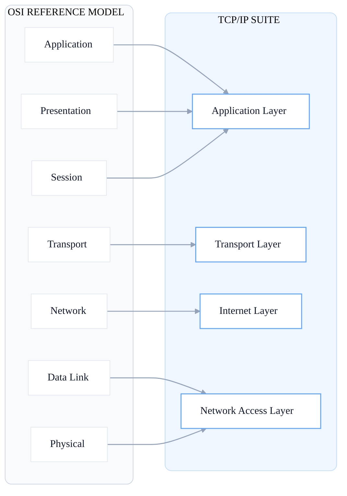

# Chapter 4: The TCP/IP Model
**The real-world protocol stack that powers the internet.**

While the OSI model is theoretical, academic, and architectural, the **TCP/IP model is real-world**. It is the practical model that every device, website, and packet on the internet _actually_ uses.
- **OSI Model** = The Blueprint 
- **TCP/IP Model** = The Actual Building 

### A Brief History
Developed by the US Department of Defense in the 1970s, it was born from the **ARPANET** project the direct ancestor of the modern internet.

## TCP/IP ↔ OSI Layer Mapping

The classic TCP/IP model has **four practical layers** (though some modern versions show five). It simplifies the OSI model by collapsing the 7 layers into broader, highly functional categories.


---


## 1️⃣ Network Access Layer (Link Layer)

_Maps to OSI Layers 1 (Physical) & 2 (Data Link)_

This layer handles physically moving data across a local network.
- **Physical Hardware:** Manages cables, wireless signals, radios, antennas, and connectors.
- **Data Link Framing:** Packages data into frames for local delivery.
- **MAC Addressing:** Utilizes the unique MAC addresses burned into network cards to identify devices locally.
- **Core Protocols:** Ethernet (wired) and Wi-Fi / 802.11 (wireless).

---

## 2️⃣ Internet Layer

_Maps to OSI Layer 3 (Network)_

The internet layer handles logical addressing and routing packets between different networks.
- **IP (Internet Protocol):** The core protocol (IPv4 and IPv6). Assigns logical IP addresses and routes packets across the globe. Every device needs one.
- **ARP (Address Resolution Protocol):** Bridges this layer with the Network Access layer by resolving IP addresses to local MAC addresses.
- **ICMP (Internet Control Message Protocol):** Handles error messages and diagnostics.


> **Cybersecurity Spotlight: PING & NMAP** Ping is often the very first tool attackers, defenders, and sysadmins use to check if a device is alive.
> 
> **How Nmap works:** Tools like Nmap use ICMP and TCP/IP probing to map entire networks.
> 
> ```
> # Ping scan an entire subnet to find live hosts
> $ nmap -sn 192.168.1.0/24 
> ```
> 
> - **Red Team:** Uses Nmap to discover the attack surface.
> - **Blue Team:** Monitors for unauthorized Nmap scans.

---

## 3️⃣ Transport Layer

_Maps to OSI Layer 4 (Transport)_

This layer manages the end-to-end delivery of data between applications. **Port numbers** live here, deciding _which_ application on the device receives the incoming data.

There are two main protocols at this layer:
#### TCP (Transmission Control Protocol)
- **Connection-oriented:** Requires a handshake before sending data.
- **Reliable:** Guaranteed delivery with no packet loss.
- **Ordered:** Ensures packets arrive and are assembled in the correct sequence.
- **Error Checking:** Includes built-in retransmission for lost packets.
- _Used by:_ HTTP, HTTPS, SSH, Email.
- _Attack Vector:_ SYN Flood DoS attacks.
    

#### UDP (User Datagram Protocol)
- **Connectionless:** No handshake required.
- **Fast:** Minimal overhead makes it incredibly quick.
- **Best Effort:** No guarantee of delivery or ordering    
- _Used by:_ DNS, Streaming, VoIP, Gaming.
- _Attack Vector:_ UDP Flood / Amplification attacks.

---

## 4️⃣ Application Layer

_Maps to OSI Layers 5, 6, & 7 (Session, Presentation, Application)_

The biggest layer in the TCP/IP model. It handles all application, presentation, and session responsibilities in one place. Every protocol here has a history of vulnerabilities, making it a critical area for cybersecurity.

#### Application Layer Protocol Security Scorecard

| Protocol   | Port   | Encrypted? | Plaintext Risk                            | Safer Alternative        |
| ---------- | ------ | ---------- | ----------------------------------------- | ------------------------ |
| **HTTP**   | 80     | **NO**     | Passwords, cookies, and all data visible  | Use **HTTPS** (port 443) |
| **FTP**    | 21     | **NO**     | Credentials transmitted in cleartext      | Use **SFTP** (port 22)   |
| **Telnet** | 23     | **NO**     | Everything sent in cleartext (NEVER USE)  | Use **SSH** (port 22)    |
| **SMTP**   | 25/587 | _Optional_ | Spoofed senders, abused for phishing/spam | SMTP+TLS, SPF/DKIM       |
| **DNS**    | 53     | _Optional_ | DNS poisoning, spoofed responses          | DNSSEC, DoH, DoT         |
| **HTTPS**  | 443    | **YES**    | None - TLS encrypted                      | _Already secure ✓_       |
| **SSH**    | 22     | **YES**    | None - fully encrypted tunnel             | _Use key-based auth ✓_   |
| **SFTP**   | 22     | **YES**    | None - runs securely over SSH             | _Already secure ✓_       |

_(Note: **DHCP** operates on Ports 67/68 and is vulnerable to starvation and rogue DHCP attacks; **IMAP/POP3** operate on 143/110 but should only be used on their TLS versions 993/995)._

#### Why Learn BOTH OSI and TCP/IP?

If TCP/IP is what actually runs the internet, why bother learning the OSI model? Because security professionals need fluency in both!

#### OSI Model -> Use it for THINKING
- **Mental Framework:** Helps diagnose and categorize network issues ("Is this a Layer 3 or Layer 7 problem?").
- **Documentation:** Excellent for teaching and mapping out attack surfaces.
- **Exams:** Heavily featured in CompTIA Security+, CEH, and other certifications.

#### TCP/IP Model -> Use it for DOING
- **Real-World Reality:** Every device on the internet runs this.
- **Implementation:** Actually configuring HTTP, DNS, or SSH.
- **Troubleshooting:** Packet analysis with Wireshark, penetration testing, and writing real-world firewall rules.

**Summary:** OSI is the mental map. TCP/IP is the real road.
