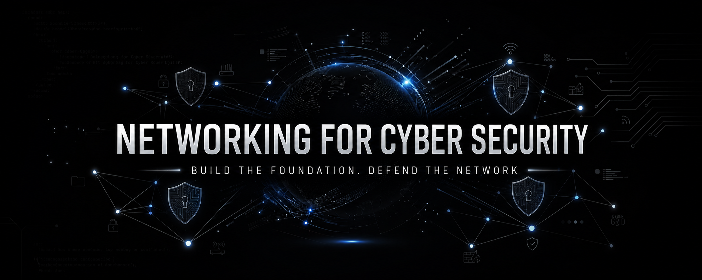

    <strong style="font-size: 2rem; background: linear-gradient(120deg, #0f172a, #2d3a5e); background-clip: text; -webkit-background-clip: text; color: transparent;">Networking for Cyber Security</strong> 
    The absolute foundation of your cybersecurity career. 
    You cannot secure or exploit what you do not understand.

## The Vision

> _"We are going to look at every step, every protocol, every port, every tiny detail of that journey. If you want to defend systems, if you want to work in cyber security or any IT field, you need to understand networking. This guide might just be the most valuable resource you'll read in your entire journey. By the end of this curriculum, you'll see the internet in a way you've never seen it before. So, that's exactly what we're doing today. We're going to build that foundation from scratch. This is networking basics for cyber security."_

Welcome to the **Networking for Cyber Security** guide!

This repository contains a comprehensive, zero-to-hero, 8-chapter learning path designed specifically for aspiring and current cybersecurity professionals. Whether your goal is to become a Penetration Tester, a SOC Analyst, or a Cloud Security Engineer, this curriculum strips away the fluff and focuses purely on the networking concepts, protocols, and architectures that actually matter in the real world of infosec.

### What You Will Learn

- **Architecture:** How packets physically and logically travel across the globe.
- **Frameworks:** Practical mapping of the OSI and TCP/IP models.
- **Core Protocols:** TCP, UDP, IP, DNS, HTTP/S, and the 13 critical ports.
- **Threat Landscapes:** Real-world attacks tied to network layers (e.g., SYN Floods, DHCP Starvation, DNS Poisoning, DDoS).
- **The Big Picture:** Tracing a full packet journey from a URL to a rendered web page, highlighting the attack surface at every step.

## Course Modules

All course materials are cleanly organized in the [`Chapters/`](./Chapters/ "null") directory. Dive into any module below:
- [**Chapter 1: Introduction & Networking Basics**](./Chapters/Chapter%201.md "null")
    - _Discover what a network is, why networking is the foundation of cybersecurity, and key terms like IP addresses, ports, and protocols._
- [**Chapter 2: Network Fundamentals**](./Chapters/Chapter%202.md "null")
    - _Learn about types of networks, hardware (Routers, Switches, Firewalls), packet switching, client-server architectures, and bandwidth vs. latency._
- [**Chapter 3: The OSI Model**](./Chapters/Chapter%203.md "null")
    - _A visual breakdown of all 7 layers (Physical to Application), encapsulation, memory tricks, and real-world attacks at every OSI layer._
- [**Chapter 4: The TCP/IP Model**](./Chapters/Chapter%204.md "null")
    - _Explore what actually runs the internet by mapping OSI to TCP/IP, covering the Network Access, Internet, Transport, and Application layers._
- [**Chapter 5: IP Addresses & Addressing**](./Chapters/Chapter%205.md "null")
    - _Master IPv4 vs IPv6, Public/Private IPs, NAT, DHCP attacks, MAC spoofing, and get a crash course in Subnetting and CIDR notation._
- [**Chapter 6: Ports & Protocols**](./Chapters/Chapter%206.md "null")
    - _Understand port ranges, the 13 critical ports you must memorize, DNS vulnerabilities, and secure vs. insecure protocols (HTTPS, SSH, SFTP vs. HTTP, Telnet, FTP)._
- [**Chapter 7: TCP vs UDP**](./Chapters/Chapter%207.md "null")
    - _Deep dive into transport protocols: TCP's 3-way handshake and SYN floods vs. UDP's connectionless speed and amplification DDoS attacks._
- [**Chapter 8: The Big Picture**](./Chapters/Chapter%208.md "null")
    - _Bring it all together by tracing the full journey from URL to web page, analyzing the attack surface at every single step along the way._

## How to Use This Guide

**No prior networking experience is required.** If you are new, we highly recommend reading the chapters in chronological order (from 1 to 8), as the concepts build directly upon one another.

If you already have a basic IT background, feel free to treat this repository as a reference manual and jump straight into the later chapters to review specific protocols and their associated attacks.

## Contributing
We believe in community-driven learning! Found a typo, or have a brilliant idea to make a chapter better? Contributions are actively welcomed.
1. Fork the repository.
2. Create a new branch (`git checkout -b feature/awesome-addition`).
3. Make your changes to the relevant `.md` file.
4. Commit your changes (`git commit -m 'Add detailed section on VLAN Hopping to Chapter 8'`).
5. Push to the branch (`git push origin feature/awesome-addition`).
6. Open a **Pull Request**.
